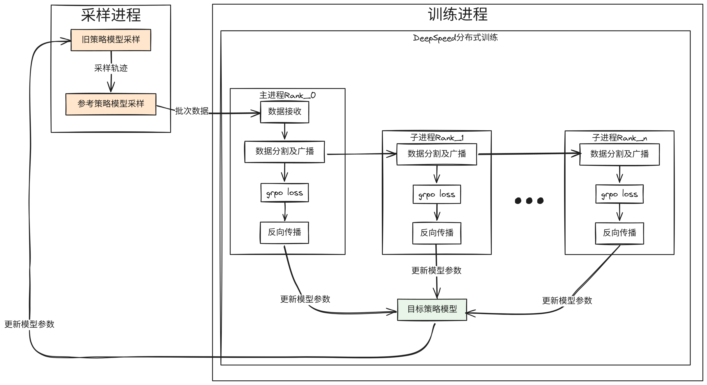

# GRPO方法复现
本项目复现了deepseek的[GRPO算法](https://arxiv.org/pdf/2402.03300), 用GSM8K数据集微调qwen2.5-3B-Instruct模型

## 训练效果
(效果图展示)

## GRPO算法
GRPO在PPO算法的基础上改进, PPO算法为Actor-Critic网络结构, 需要同时训练Actor和Critci两个网络, 对于动辄几十亿参数的大语言模型来说训练开销太大. GRPO方法的优化点在于对同一问题采样多次, 称为一组, 用组内回报的均值来代替Critic网络, 减少了一半训练开销. 此外, GRPO方法还引入了参考策略, 用参考策略的输出分布作为teacher让目标策略快速学习以达到teacher的水平.

目标函数:
$$
J(\theta) = E_{\pi_\theta}\left[\min\left(\frac{P_\theta(a|s)}{P_{\theta'}(a|s)}\hat{A}_{\theta'}(s, a), \text{clip}\left(\frac{P_\theta(a|s)}{P_{\theta'}(a|s)}, 1-\epsilon, 1+\epsilon\right) \hat{A}_{\theta'}(s, a)\right) - \beta D_{KL}(P_\theta, P_{ref}) \right]
$$
组内回报值:
$$
\hat{A}_{\theta'}(s, a) = \mathbf{r} - \frac{\text{mean}(\mathbf{r})}{\text{std}(\mathbf{r})}
$$

## 训练框架


### 采样进程
采样进程部署参考策略和目标模型旧策略

### 训练进程
训练进程用于训练目标模型新策略

### GRPO算法实现步骤
创建3个进程, 主进程用于训练, 其余两个一个用于旧策略采样数据, 一个用于参考策略推理

两块卡, A用于训练, B用于部署参考模型, 分为训练和推理两个程序运行

1. 训练程序: 分为pytorch训练新策略模型和vllm部署推理旧策略模型两个线程, 线程A1运行pytorch训练部分, 线程A2运行vllm部署推理旧策略为pytorch训练提供数据

2. 推理程序: 用vllm部署参考模型, 用于生成训练的参考分布, 通过fastapi的形式提供接口给训练程序调用

问答格式:
回答格式中需要包含思考过程和答案, 答案仅需要包含数字<think></think>, <answer></answer>

### importance sampling和kl divergence实现过程
.logits方法会获取通过前面token预测得到后一个token的概率分布, 而不是续写整个句子

最终loss会经过形状归一化, 归一化过程可导且可进行反向传播, 因此重要性采样和kl散度计算时可以用张量

1. $\pi_{old}$采样得到一批轨迹, 包括query和answer
2. 拼接query和answer, 得到trajectory
3. trajectory过一遍$\pi_{old}$获取每个token的概率分布
4. trajectory过一遍$\pi_{new}$获取每个token的概率分布
5. trajectory过一遍$\pi_{ref}$获取每个token的概率分布
6. $\pi_{old}$和$\pi_{new}$的token概率分布比值为重要性采样值(对应元素的token概率比值, 结果为一个张量)
7. $\pi_{new}$和$\pi_{ref}$的token概率分布比值计算KL散度

## GSM8K数据集
GSM8K数据集是由8.5K个高质量的小学数学问题组成的语言模型训练数据集. 每个问题包含"question"和"answer"两个字段, answer中给出了问题的推理过程和最终的答案. 数据实例如下所示:

```
question: Natalia sold clips to 48 of her friends in April, and then she sold half as many clips in May. How many clips did Natalia sell altogether in April and May?
answer: Natalia sold 48/2 = <<48/2=24>>24 clips in May.
Natalia sold 48+24 = <<48+24=72>>72 clips altogether in April and May.
#### 72
```

### Reward Function
1. 答案奖励: 答案正确奖励+1, 错误奖励-1
2. 格式奖励: 格式正确奖励+1.25, 错误奖励-1

## 部署步骤
```bash
# GSM8K数据集下载
git clone https://huggingface.co/datasets/openai/gsm8k
# Qwen2.5-3B-Instruct模型下载
git clone https://huggingface.co/Qwen/Qwen2.5-3B-Instruct
# 启动采样进程
python sampling.py
# 启动分布式训练进程
CUDA_VISIBLE_DEVICES=0,1 deepspeed --num_gpus=2 training_worker.py
```

## 显存估算
本项目在FP16/BF16全量微调情况下需要60~70GB左右显存, LoRA微调需要30~40GB左右显存. 显存占用来自3部分, 参考模型部署和推理, 目标模型旧策略部署和推理, 目标模型新策略训练.

本项目中参考模型和目标模型都用Qwen2.5-3B-Instruct, 参数类型为BF16, 参考模型、目标模型旧策略的部署和推理约占20G左右显存. 目标模型新策略训练占用情况如下表所示

全量微调显存占用分析表
| 配置                                     | 显存占用 |
|-----------------------------------------|---------|
| 模型参数(1份模型参数)                      | 6GB     |
| 梯度(1份模型参数)                         | 6GB     |
| AdamW优化器(F32 2份模型参数, 1阶矩+2阶矩)   | 24GB    |
| 激活值等                                 | 5-15GB  |
| 总计                                    | 41-51GB  |

LoRA微调显存显存占用分析表
| 配置                                       |   显存占用    |
|--------------------------------------------|-------------|
| 模型参数(1份模型参数+1份旁路矩阵参数)           | 6GB+0.2GB   |
| 梯度(1份旁路矩阵参数)                        | 0.2GB       |
| AdamW优化器(F32 2份旁路矩阵参数, 1阶矩+2阶矩)  | 0.75GB      |
| 激活值等                                    | 5-15GB      |
| 总计                                       | 12-22GB     |

LoRA旁路矩阵的参数量估算方式:
$$
n_{LoRA} = n_{total} \frac{2r}{d_{model}}
$$
n_LoRA表示LoRA的旁路矩阵参数量, n_total表示模型的总参数量, r表示秩(旁路矩阵的维度), d_model表示模型的隐藏层维度.
对于Qwen2.5-3B模型来说d_model=2048, 以r=32为例, 涉及到训练参数, 梯度, 优化器状态的旁路矩阵参数量为全量微调的64/2048=1/32

## 待完善:
1. 正确率评估
2. 达到某个条件结束训练
3. 全量微调结果查看
4. 用qwen2.5-1.5B模型进行微调
5. LoRA方案实现

## 踩坑记录
1. autodl vgpu进行分布式训练时需要把后台通信改为gloo, nccl仅支持物理GPU的通信
2. 类似GRPO算法涉及到旧策略、新策略、参考策略多个模型, 若采样与训练分离在多个GPU上, 用deepspeed进行分布式时需要注意数据并行需要手动完成, 通过zmq或socket等方式完成通信后, 在deepspeed fork的进程中区分主副进程, 主进程分割数据广播至副进程, 防止资源竞争
3. 同样从训练进程同步模型参数至采样进程时, 也需要通过主进程单独完成

## 参考资料
- [GRPO论文](https://arxiv.org/pdf/2402.03300)
- [GRPO-Zero](https://github.com/policy-gradient/GRPO-Zero)
- [simple_GRPO](https://github.com/lsdefine/simple_GRPO)
- [Qwen2.5](https://huggingface.co/Qwen/Qwen2.5-3B-Instruct)
- [GSM8K](https://huggingface.co/datasets/openai/gsm8k)