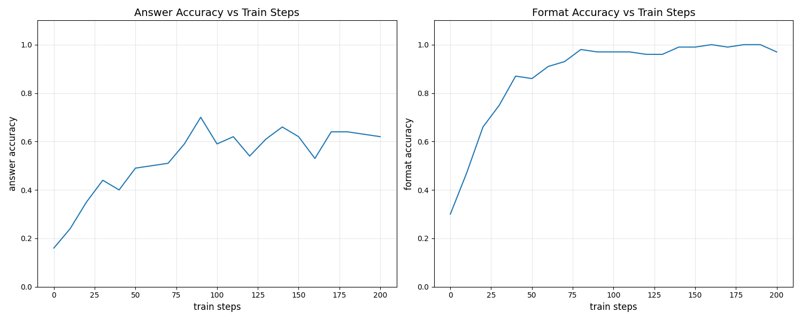

# GRPO方法复现
本项目实现了qwen2.5-1.5B-Instruct模型在GSM8K数据集上的全量微调, 以清晰的逻辑复现了完整的[GRPO算法](https://arxiv.org/pdf/2402.03300), 包括旧策略采样、参考策略采样和新策略训练. 本项中搭建的分布式训练框架适合off policy方法与deepspeed结合进行LLM分布式微调.

## 训练框架


项目主要分为采样进程和训练进程:
* 采样进程: 旧策略轨迹采样 + 旧策略概率分布推理 + 新策略的概率分布推理
* 训练进程: deepspeed自动fork多个子进程Rank_n, 各子进程中进行数据分割及分布式训练
* 训练数据传递: 采样进程->训练进程, 用zmq实现
* 模型参数同步: 训练进程->采样进程, 用文件系统实现

## GRPO算法原理
GRPO在PPO算法的基础上改进, PPO算法为Actor-Critic网络结构, 需要同时训练Actor和Critci两个网络, 对于动辄几十亿参数的大语言模型来说训练开销太大. GRPO方法的优化点在于对同一问题采样多次, 称为一组, 用组内回报的均值来代替Critic网络, 减少了一半训练开销. 此外, GRPO方法还引入了参考策略, 用参考策略的输出分布作为teacher让目标策略快速学习以达到teacher的水平.

目标函数:

$$
J(\theta) = E_{\pi_\theta}\left[\min\left(\frac{P_\theta(a|s)}{P_{\theta'}(a|s)}\hat{A}_{\theta'}(s, a), \text{clip}\left(\frac{P_\theta(a|s)}{P_{\theta'}(a|s)}, 1-\epsilon, 1+\epsilon\right) \hat{A}_{\theta'}(s, a)\right) - \beta D_{KL}(P_\theta, P_{ref}) \right]
$$

组内回报值:

$$
\hat{A}_{\theta'}(s, a) = \mathbf{r} - \frac{\text{mean}(\mathbf{r})}{\text{std}(\mathbf{r})}
$$

目标函数和Loss函的核心代码实现:
```python
ref_policy_log_probs_ = ref_policy_log_probs[:, prefix_len-1:] # 参考策略概率分布
old_policy_log_probs_ = old_policy_log_probs[:, prefix_len-1:] # 旧策略概率分布
new_policy_log_probs_ = new_policy_log_probs[:, prefix_len-1:] # 新策略概率分布
attention_mask_       = attention_mask[:, prefix_len:]

importance_ratio = torch.exp(new_policy_log_probs_ - old_policy_log_probs_) # 重要性采样
cliped_ratio = torch.clip(importance_ratio, 1 - clip_epsilon, 1 + clip_epsilon) # 相似度裁剪
importance_term = importance_ratio * advantages
clip_term = cliped_ratio * advantages

kl_term = torch.exp(ref_policy_log_probs_ - new_policy_log_probs_) - (ref_policy_log_probs_ - new_policy_log_probs_) - 1 # kl散度

objective_function = torch.min(importance_term, clip_term) - kl_beta * kl_term # 目标函数
per_token_loss = -objective_function # loss函数

loss = ((per_token_loss * attention_mask_).sum(dim=1) / attention_mask_.sum(dim=1)).mean()
```

## 数据集
GSM8K数据集是由8.5K个高质量的小学数学问题组成的语言模型训练数据集. 每个问题包含"question"和"answer"两个字段, answer中给出了问题的推理过程和最终的答案. 单个数据示例如下所示:

```
question: Natalia sold clips to 48 of her friends in April, and then she sold half as many clips in May. How many clips did Natalia sell altogether in April and May?
answer: Natalia sold 48/2 = <<48/2=24>>24 clips in May.
Natalia sold 48+24 = <<48+24=72>>72 clips altogether in April and May.
#### 72
```

### 对话格式
在提示词中要求模型回复中需要包含思考过程和答案
* 思考过程需要用标签\<think\>(思考过程)\</think\>标记
* 答案需要用标签\<answer\>(答案)\</answer\>标记

### 奖励函数
* 答案奖励: 答案正确奖励+1, 错误奖励-1
* 格式奖励: 格式正确奖励+1.25, 错误奖励-1

## 效果展示
### 环境配置
* 参考模型: qwen2.5-3B-Instruct
* 目标模型: qwen2.5-1.5B-Instruct
* 硬件配置: 3 × AutoDL vGPU-32G (GPU0/1用于训练, GPU2用于采样)
* 训练步数: 200 steps

### 训练结果


准确率评估包含答案和格式两部分:

* 答案准确率在80个step达到峰值0.7左右, 最终维持在0.6左右
* 格式准确率在150个step达到峰值1.0左右, 最终维持在0.99左右

## 项目部署
```bash
# 依赖安装
pip install -r requirements.txt
# GSM8K数据集下载
git clone https://huggingface.co/datasets/openai/gsm8k
# Qwen2.5-1.5B-Instruct模型下载
git clone https://huggingface.co/Qwen/Qwen2.5-1.5B-Instruct
# Qwen2.5-3B-Instruct模型下载
git clone https://huggingface.co/Qwen/Qwen2.5-3B-Instruct
# 启动采样进程
python sampling.py
# 启动训练进程
CUDA_VISIBLE_DEVICES=0,1 deepspeed --num_gpus=2 training_worker.py
```

## 待完善:
* LoRA方案实现
* 清理代码结构

## 踩坑记录
* AutoDL vGPU进行分布式训练时后台通信不能用默认的nccl, 需要改为gloo, nccl仅支持物理GPU的通信.
* off policy方法涉及到旧策略、新策略等多个模型, 通常采样与训练分布不同进程中, 采样数据传输到训练进程后需要手动进行数据并行, 给deepspeed fork的各子进程手动分配数据, 否则会造成单卡数据过多且重复
* 从训练进程同步模型参数至采样进程时仅在主进程中传递即可, 否则会重复传递造成资源浪费
* LLM进行RLHF训练微调时若需要同步模型参数, 可以用文件系统实现. LLM通常参数量较大, 若用网络传递速度较慢且容易失败

## 参考资料
本项目基于以下优秀项目实现, 在此进行感谢
* [GRPO论文](https://arxiv.org/pdf/2402.03300) 提供了理论基础, 组内相对奖励的设计极大的减少了训练开销, 模型蒸馏思路使得小参数模型能够快速学习大参数模型的输出分布达到与其接近的水平.
* [GRPO-Zero](https://github.com/policy-gradient/GRPO-Zero) 用清晰的代码逻辑实现了GRPO方法, 并且手搓transformer网络、qwen模型结构和AdamW, 是一份非常优秀的示例代码.
* [simple_GRPO](https://github.com/lsdefine/simple_GRPO) 提供了采样-训练双进程实现的思路, 并且以非常简介的形式复现了GRPO方法.
* [Qwen2.5](https://huggingface.co/Qwen/Qwen2.5-3B-Instruct) 提供了高质量的qwen系列预训练模型.
* [GSM8K](https://huggingface.co/datasets/openai/gsm8k) 提供了高质的问答数据.