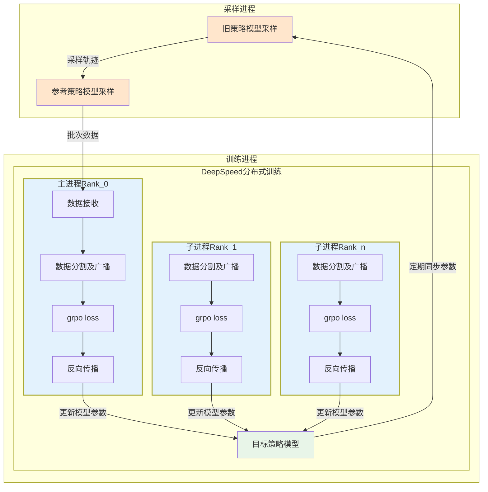

# GRPO分布式训练方案

## 概述

本方案将原有的三进程架构改为双进程架构，便于使用DeepSpeed进行分布式训练：
- **采样进程** (`sampling_worker.py`): 合并旧的策略采样和参考策略计算
- **训练进程** (`training_worker.py`): 负责模型训练，支持DeepSpeed分布式训练

## 通信架构

使用ZeroMQ实现高性能异步通信：
- **数据通信**: 采样进程 → 训练进程 (端口5555)
- **模型同步**: 训练进程 → 采样进程 (端口5556)

## 快速开始

### 1. 安装依赖

```bash
pip install torch transformers datasets pandas numpy pyzmq deepspeed
```

### 2. 通信测试

首先测试两个进程之间的通信是否正常：

```bash
python communication_test.py
```

### 3. 单GPU训练

```bash
# 启动采样进程
python sampling_worker.py --gpu-id 0 --data-port 5555 --sync-port 5556

# 启动训练进程（另一个终端）
python training_worker.py --gpu-id 0 --data-port 5555 --sync-port 5556 --no-deepspeed
```

### 4. 多GPU分布式训练

使用启动脚本简化操作：

```bash
# 使用3个GPU进行分布式训练
# GPU 0用于采样，GPU 1-3用于训练
python run_distributed.py --sampling-gpu 0 --training-gpus "1,2,3"
```

## 详细配置

### 采样进程参数

```bash
python sampling_worker.py \
    --gpu-id 0              # 使用的GPU ID \
    --data-port 5555        # 数据发送端口 \
    --sync-port 5556        # 模型同步端口
```

### 训练进程参数

```bash
python training_worker.py \
    --gpu-id 1              # 使用的GPU ID \
    --data-port 5555        # 数据接收端口 \
    --sync-port 5556        # 模型同步端口 \
    --no-deepspeed          # 禁用DeepSpeed（可选）
```

### DeepSpeed配置

DeepSpeed配置文件会自动生成，也可以手动修改 `deepspeed.json`：

```json
{
    "train_batch_size": 16,
    "train_micro_batch_size_per_gpu": 4,
    "gradient_accumulation_steps": 1,
    "zero_optimization": {
        "stage": 2
    },
    "bf16": {
        "enabled": true
    }
}
```

## 架构对比

### 原有三进程架构
```
旧策略采样进程 → 参考策略进程 → 新策略训练进程
     GPU0            GPU1            GPU2
```

### 新双进程架构
```
采样进程（合并old+ref） → 训练进程（支持多GPU）
      GPU0               GPU1,2,3...
```

## 通信协议

### 数据传输格式

采样进程发送的数据结构：
```python
{
    'prefix': str,
    'prefix_tokens': List[str],
    'prefix_token_ids': List[int],
    'generated_token_ids': List[int],
    'whole_token_ids': List[int],
    'is_finished': bool,
    'text': str,
    'reward': float,
    'reward_info': Dict[str, float],
    'old_policy_log_probs': numpy.ndarray,
    'ref_policy_log_probs': numpy.ndarray
}
```

### 模型同步

训练进程定期将新策略模型参数发送给采样进程，保持策略一致性。

## 性能优化

### ZeroMQ配置
- 使用PUSH/PULL模式实现负载均衡
- 非阻塞发送避免进程阻塞
- 自动重连机制保证稳定性

### 内存优化
- 使用pickle序列化减少数据传输量
- 张量数据在传输前移动到CPU
- 支持经验回放缓冲区配置

### DeepSpeed优化
- ZeRO Stage 2减少内存占用
- 混合精度训练（bf16）
- 梯度累积支持大批量训练

## 故障排除

### 端口冲突
如果端口被占用，可以修改端口配置：
```bash
python sampling_worker.py --data-port 5557 --sync-port 5558
python training_worker.py --data-port 5557 --sync-port 5558
```

### GPU内存不足
- 减小批次大小：修改 `BATCH_SIZE` 参数
- 启用DeepSpeed的ZeRO Stage 3
- 使用梯度累积

### 通信超时
检查防火墙设置，确保端口开放：
```bash
# Linux
sudo ufw allow 5555
sudo ufw allow 5556

# 或者临时关闭防火墙
sudo ufw disable
```

## 监控和调试

### 日志输出
两个进程都会输出详细的运行日志：
- 采样进度和性能统计
- 训练损失和准确率
- 模型同步状态
- 通信统计信息

### 性能监控
可以通过日志中的信息监控：
- 每秒采样批次数量
- 训练步骤时间
- 通信延迟
- GPU利用率

## 扩展功能

### 多采样进程
可以通过启动多个采样进程提高数据生成速度：
```bash
# 采样进程1
python sampling_worker.py --gpu-id 0 --data-port 5555 --sync-port 5556

# 采样进程2
python sampling_worker.py --gpu-id 1 --data-port 5555 --sync-port 5556
```

### 检查点管理
训练进程会自动保存检查点：
- 每1000步保存一次
- 支持DeepSpeed和普通PyTorch格式
- 可以从检查点恢复训练

## 注意事项

1. **模型文件**: 确保 `Qwen2.5-3B-Instruct` 模型文件存在
2. **数据文件**: 确保 `gsm8k` 数据集存在
3. **GPU资源**: 确保有足够的GPU内存
4. **网络配置**: 确保通信端口未被占用
5. **依赖版本**: 建议使用推荐版本的依赖包

## 联系和支持

如遇到问题，请检查日志输出并确保所有依赖项正确安装。可以根据具体的错误信息进行调试和修复。

